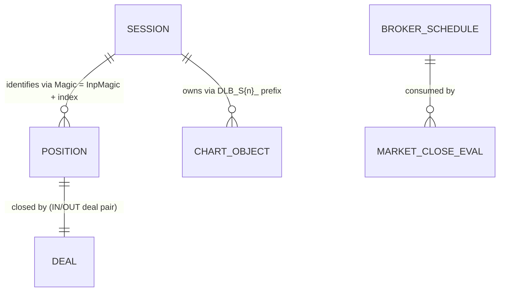
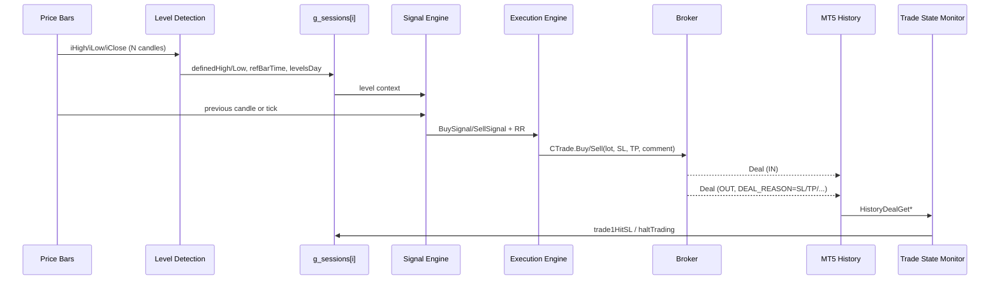
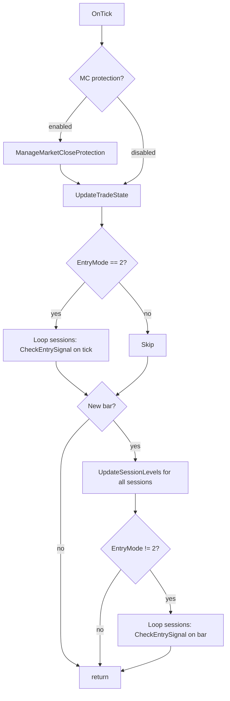
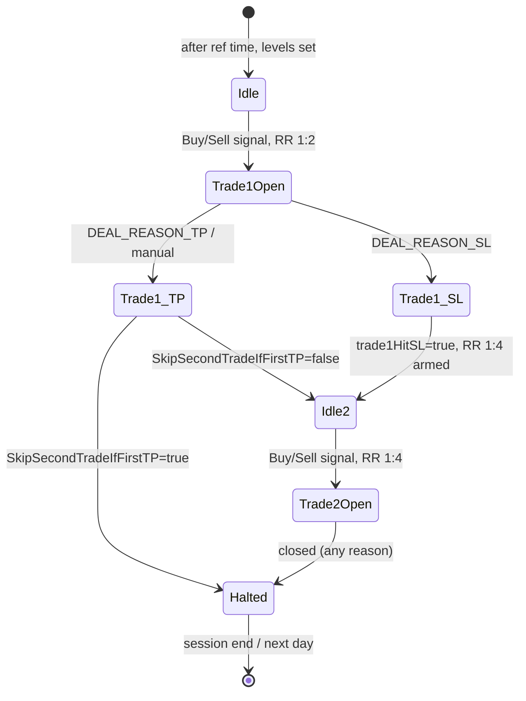

# DailyLevelsBreakout_EA — Software Architecture Document

**Application:** `DailyLevelsBreakout_EA.mq5`
**Version:** 2.20
**Platform:** MetaTrader 5 (MQL5)
**Type:** Expert Advisor (automated trading robot)
**Document Date:** 2026-07-31

---

## 1. Overview

### 1.1 Application Purpose

`DailyLevelsBreakout_EA` is a MetaTrader 5 **Expert Advisor (EA)** — a compiled trading algorithm that executes automated orders on a broker's trading platform. Its objective is to detect **dynamic daily High/Low breakout levels** for up to four independent intraday trading sessions and open managed trades (with defined Stop Loss and Take Profit) whenever price breaks out of those levels.

### 1.2 Main Goals

1. Detect daily High/Low levels using one of three configurable **detection methods**.
2. Operate **four fully independent trading sessions** in parallel (each with its own reference time, end time, color, and state machine).
3. Manage entries via one of three **entry modes** (DMT / Breakout Tick / Breakout Candle-Close).
4. Enforce a **two-trade-per-session** rule: first trade at RR 1:2, second (only after SL) at RR 1:4.
5. Protect capital via a **Market-Close Protection** module that flattens exposure before the broker's session ends.
6. Render **interactive chart objects** (lines, labels, reset button) that the user can drag to override levels manually.

### 1.3 High-Level Description

The EA is a **single-file, event-driven MQL5 program** loaded into a MetaTrader 5 chart. It reacts to three MT5 event pumps: `OnTick` (price events), `OnTimer` (5-second watchdog), and `OnChartEvent` (UI interaction). All state is held in-process; there is no external database. Persistence between restarts is delegated to MT5's history and object storage on the chart.

---

## 2. Architecture Overview

### 2.1 Architecture Style

| Aspect                | Style                                                                                       |
|-----------------------|---------------------------------------------------------------------------------------------|
| Overall paradigm      | **Monolithic, single-translation-unit program**                                             |
| Runtime model         | **Event-driven** (callbacks from MT5 terminal)                                              |
| Internal organization | **Layered / modular procedural** (input → detection → signal → execution → protection → UI) |
| Concurrency           | **Single-threaded** cooperative; MT5 serialises `OnTick`/`OnTimer`/`OnChartEvent`           |
| State management      | **Global in-memory struct array** (`SessionData g_sessions[4]`)                             |

### 2.2 Main Components

| # | Component                          | Responsibility                                                                   |
|---|------------------------------------|----------------------------------------------------------------------------------|
| 1 | **Input Layer**                    | Declares user-configurable `input` parameters (grouped by concern).              |
| 2 | **Session State Model**            | `SessionData` struct + `g_sessions[4]` — per-session runtime state.              |
| 3 | **Level Detection Engine**         | Computes daily High/Low using Method 1/2/3.                                      |
| 4 | **Signal Engine**                  | Evaluates breakout signals per entry mode (1/2/3).                               |
| 5 | **Execution Engine**               | Builds SL/TP, sizes lots, sends orders via `CTrade`.                             |
| 6 | **Trade State Monitor**            | Reconciles closed deals against MT5 history to update session state.             |
| 7 | **Market-Close Protection Module** | Reads broker session schedule, flattens exposure near close.                 |
| 8 | **UI / Charting Layer**            | Draws High/Low lines, price labels, reference vertical line and Reset button.    |
| 9 | **Event Router**                   | `OnInit` / `OnTick` / `OnTimer` / `OnChartEvent` / `OnDeinit`.                   |

### 2.3 Communication Flow

```mermaid
flowchart TD
    MT5[MT5 Terminal] -->|OnTick| Router
    MT5 -->|OnTimer 5s| Router
    MT5 -->|OnChartEvent| Router

    Router[Event Router] --> MCP[Market-Close Protection]
    Router --> TSM[Trade State Monitor]
    Router --> DET[Level Detection Engine]
    Router --> SIG[Signal Engine]
    Router --> UI[Chart UI Layer]

    DET -->|writes| STATE[(g_sessions[4])]
    SIG -->|reads| STATE
    SIG --> EXEC[Execution Engine]
    EXEC -->|CTrade| BROKER[(Broker / MT5 Server)]
    TSM -->|HistoryDeal*| BROKER
    TSM -->|writes| STATE
    MCP -->|SymbolInfoSessionTrade| BROKER
    MCP -->|flatten| EXEC
    UI -->|Object* API| CHART[MT5 Chart Objects]
    UI -->|drag events| STATE
```

---

## 3. System Components

### 3.1 Input Layer

- **Responsibility:** Expose all configuration to the trader via MT5's "Inputs" dialog.
- **Structure:** Flat list of `input` declarations organised by `input group "..."` headers.
- **Groups:**
  1. `Daily Level Detection` — `InpLookbackN`, `InpUpdateX`, `InpMethod`, `InpUpdateMode`.
  2. `Session 1..4` — enable flag, reference H/M, end H/M, line color.
  3. `Trade Execution` — `InpEntryMode`, `InpSkipSecondTradeIfFirstTP`, SL/TP buffers, risk sizing, magic number, slippage.
  4. `Close Before Market Close` — `EnableCloseBeforeMarketClose`, `MinutesBeforeMarketClose`, merge gap, EA-only flag.
  5. `Display` — draw flags, line styles, font size.
  6. `Reset Button UI Settings` — anchor corner, X/Y offset, width/height.
- **Enums:** `ENUM_DETECTION_METHOD`, `ENUM_UPDATE_MODE`, `ENUM_ENTRY_MODE`.

### 3.2 Session State Model

- **Struct:** `SessionData`
- **Instance:** `SessionData g_sessions[4];`
- **Fields:**

| Field                                           | Purpose                                               |
|-------------------------------------------------|-------------------------------------------------------|
| `enable`, `refH/refM`, `endH/endM`, `lineColor` | Configuration mirror                                  |
| `levelsSet`, `levelsDay`                        | Whether today's levels have been committed            |
| `definedHigh`, `definedLow`                     | Live High/Low (may be user-adjusted via drag)         |
| `originalHigh`, `originalLow`                   | Snapshot used by the Reset button                     |
| `refBarTime`, `lineStartTime`, `lineEndTime`    | Anchors for chart drawing                             |
| `tradesToday`                                   | Counter 0..2                                          |
| `trade1HitSL`                                   | Gate that unlocks trade 2                             |
| `haltTrading`                                   | Session terminal flag                                 |
| `buyTriggered`, `sellTriggered`                 | Direction locks preventing repeat entries             |

### 3.3 Level Detection Engine — `UpdateSessionLevels(int sessionIndex)`

- **Responsibility:** Compute today's High/Low for a single session.
- **Dependencies:** `iTime`, `iHigh`, `iLow`, `iHighest`, `iLowest`, `iOpen`, `iClose`, `Bars`, `iBarShift`.
- **Inputs:** Session ref time, `InpMethod`, `InpLookbackN`, `InpUpdateX`, `InpUpdateMode`.
- **Outputs:** Writes into `g_sessions[i]` and triggers `DrawSessionLevelLines`.
- **Algorithm variants:**
  - **Method 1** — Highest/Lowest of the `N` candles preceding the reference candle.
  - **Method 2** — Method 1 plus a confirmation update: if the highest precedes the lowest and ≥ `X` bearish candles exist between them, refresh the low (mirror logic for the up-side).
  - **Method 3** — Directly uses the (fully closed) reference candle's OHLC.

### 3.4 Signal Engine — `CheckEntrySignal(int sessionIndex)`

- **Responsibility:** Decide whether a Buy or Sell should be triggered for a session.
- **Guards:** `levelsSet`, `!haltTrading`, no open position for this session's Magic.
- **Entry Modes:**

| Mode                           | Trigger                                                                              | Filters                                                                              |
|--------------------------------|--------------------------------------------------------------------------------------|--------------------------------------------------------------------------------------|
| `ENTRY_MODE_1` (DMT)           | Closed candle **closes beyond** the level with **body-past-level > wick-past-level** | `rangeOK` (candle range < level range), `originOK` (candle open inside the H/L band) |
| `ENTRY_MODE_2` (Tick breakout) | **Bid** crosses the level intra-bar                                                  | None (evaluated on every tick)                                                       |
| `ENTRY_MODE_3` (Candle-close)  | Previous candle **closes beyond** the level                                          | None                                                                                 |

- **Trade-management logic:**
  - `tradesToday == 0` → RR 1:2.
  - `tradesToday == 1` and `trade1HitSL` → RR 1:4 (second trade allowed).
  - `tradesToday == 1` and TP with `InpSkipSecondTradeIfFirstTP` → halt.
  - `tradesToday == 1` and manual close with `InpSkipSecondTradeIfFirstTP` → RR 1:4 (second trade allowed)
  - `tradesToday >= 2` → halt. 


### 3.5 Execution Engine — `ExecuteTrade(...)` and `CalcLots(...)`

- **Responsibility:** Translate a signal into a market order.
- **Dependencies:** `CTrade` (from `<Trade\Trade.mqh>`), `SymbolInfoTick`, `SymbolInfoDouble`, `SymbolInfoInteger`, `AccountInfoDouble`.
- **SL sources (per entry mode):**
  - Mode 1 → 2-bars-ago Low/High ± buffer.
  - Mode 2 → session's `definedLow`/`definedHigh` ± buffer.
  - Mode 3 → entry price ± previous candle range ± buffer.
- **TP computation:** `entry ± (SL_dist × RR) ∓ TP_buffer`.
- **Broker sanity:** Verifies `SYMBOL_TRADE_STOPS_LEVEL` compliance.
- **Sizing:** Risk-percent (`AccountInfoDouble(ACCOUNT_BALANCE)`) or fixed lot, clamped to `SYMBOL_VOLUME_MIN/MAX/STEP`.
- **Magic scheme:** `InpMagic + sessionIndex` (per-session identity).
- **Comment format:** `"DLB S%d [%02d:%02d-%02d:%02d] T%d RR1:%.0f"`.

### 3.6 Trade State Monitor — `UpdateTradeState()`

- **Responsibility:** After a position closes, discover **why** (SL vs TP vs manual) via `HistoryDealGetInteger(..., DEAL_REASON)` and mutate `trade1HitSL` / `haltTrading` accordingly.
- **Filters:** By `_Symbol` and by expected Magic (`InpMagic + sessionIndex`).
- **Runs:** On every tick (cheap; short-circuits when `tradesToday == 0`).

### 3.7 Market-Close Protection Module

- **Responsibility:** Cancel pendings and flatten positions before the broker's real session close, then block re-entry until the next session opens.
- **Key functions:**
  - `MarketCloseServerNow()` — max of `TimeTradeServer` and `TimeCurrent`.
  - `MarketCloseGetDaySessions()` — reads up to 24 broker sessions via `SymbolInfoSessionTrade`.
  - `MarketCloseGetMarketCloseTime()` — merges contiguous sessions (via `InpMC_SessionMergeGapMin`) and rolls through midnight (Mon–Thu style) to compute the **real** close.
  - `MarketCloseGetNextSessionStart()` — scans up to 8 days forward.
  - `MarketCloseHasExposure()` / `MarketCloseCancelPendingOrders()` / `MarketCloseCloseAllPositions()` — action helpers.
  - `ManageMarketCloseProtection()` — controller; called from both `OnTick` and `OnTimer` (5-s watchdog).
- **State flags:** `g_mcBlockTrading`, `g_mcResumeTime`, `g_mcHandledClose`, `g_mcLoggedClose`, `g_mcLastLoggedMin`, `g_mcMinutes`, `g_mcNoSchedWarned`.

### 3.8 UI / Charting Layer

- **Chart objects created per session (prefix `DLB_S{n}_`):**
  - `RefTime_{date}` — `OBJ_VLINE` (vertical reference line).
  - `High_{date}` / `Low_{date}` — `OBJ_TREND` (selectable, non-ray, drag-locked to horizontal).
  - `HighLabel_{date}` / `LowLabel_{date}` — `OBJ_TEXT` (right-anchored price labels).
- **Global button:** `DLB_ResetBtn` — `OBJ_BUTTON`, reverts all sessions to `originalHigh/Low`.
- **Interaction handler:** `UpdateLevelsFromChartLines()` clamps both anchors to a single price and locks the time endpoints to `lineStartTime`/`lineEndTime`, preventing horizontal drag.

### 3.9 Event Router (MT5 lifecycle callbacks)

| Callback         | Role                                                                                                                            |
|------------------|---------------------------------------------------------------------------------------------------------------------------------|
| `OnInit`         | Validate inputs, `ZeroMemory(g_sessions)`, initialise session config, `EventSetTimer(5)`, create Reset button, prime levels.    |
| `OnDeinit`       | `ObjectsDeleteAll(0, OBJ_PREFIX)`, `EventKillTimer()`.                                                                          |
| `OnTick`         | MC protection → trade state → tick-mode signals (Mode 2) → new-bar handling → level recalc → bar-mode signals (Modes 1 & 3).    |
| `OnTimer`        | Watchdog for MC protection when ticks pause.                                                                                    |
| `OnChartEvent`   | Object drag/change → `UpdateLevelsFromChartLines`; button click → `ResetLevelsToOriginal`.                                      |

---

## 4. Data Architecture

### 4.1 Storage Strategy

There is **no external database**. The EA uses three storage tiers:

1. **In-memory globals** — `SessionData g_sessions[4]`, `g_mc*` flags, `g_lastBarTime`, etc. **Volatile** (lost on reload).
2. **MT5 chart objects** — lines, labels, button. Persist as long as the chart lives.
3. **MT5 trade history** — the authoritative source for closed-deal reasons, accessed via `HistorySelect` / `HistoryDeal*`.

### 4.2 Main "Entities"

| Entity                    | Kind                  | Fields (selected)                                                                                                                                                                                                 |
|---------------------------|-----------------------|-------------------------------------------------------------------------------------------------------------------------------------------------------------------------------------------------------------------|
| `SessionData`             | Runtime struct        | `enable, refH, refM, endH, endM, lineColor, levelsSet, levelsDay, definedHigh, definedLow, originalHigh, originalLow, refBarTime, lineStartTime, lineEndTime, tradesToday, trade1HitSL, haltTrading, buyTriggered, sellTriggered` |
| `Position` (broker-side)  | Read via `PositionGet*` | Symbol, Magic (= `InpMagic + s`), Volume, Type, Profit                                                                                                                                                           |
| `Deal` (broker-side)      | Read via `HistoryDealGet*` | Symbol, Magic, Entry (IN/OUT), Reason (SL/TP/...)                                                                                                                                                           |
| `Broker Session Schedule` | Read via `SymbolInfoSessionTrade` | Start/End seconds per weekday                                                                                                                                                                            |

### 4.3 Relationships



### 4.4 Data Flow



---

## 5. Application Flow

### 5.1 Attach / Initialisation

1. `OnInit` validates ref times per session; on error returns `INIT_PARAMETERS_INCORRECT`.
2. `ZeroMemory(g_sessions)` — forces a full recalc when inputs change.
3. Configures `CTrade` (slippage + filling mode).
4. Arms the 5-second timer if Market-Close Protection is enabled.
5. Attempts an immediate level computation for each session (in case reference time has already passed today).

### 5.2 Per-Tick Loop



### 5.3 Two-Trade Session Life-Cycle



### 5.4 Market-Close Protection Flow

1. `MarketCloseGetMarketCloseTime` resolves the **real** close (merging split sessions + midnight roll-over).
2. When `remainingSeconds <= g_mcMinutes * 60`, the controller:
   - Sets `g_mcBlockTrading = true`.
   - Cancels pending orders → closes positions (retries every 3 s until flat).
   - Computes `g_mcResumeTime` via `MarketCloseGetNextSessionStart`.
3. On the next tick/timer after `currentServerTime >= g_mcResumeTime`, block is released.

### 5.5 Manual Level Override

1. User drags a High/Low `OBJ_TREND`.
2. MT5 fires `CHARTEVENT_OBJECT_DRAG`.
3. `UpdateLevelsFromChartLines` snaps both anchors to a single price, re-locks time endpoints, updates `definedHigh/Low` and the price label.
4. Subsequent signals use the new level; **`originalHigh/Low` untouched** so the Reset button can restore.

---

## 6. Technology Stack

| Layer             | Technology                                                                                                                                             |
|-------------------|--------------------------------------------------------------------------------------------------------------------------------------------------------|
| Language          | **MQL5** (C-like, MetaQuotes)                                                                                                                          |
| Platform          | **MetaTrader 5** terminal (Windows / Wine)                                                                                                             |
| Compiler          | MetaEditor (bundled with MT5)                                                                                                                          |
| Standard library  | `<Trade\Trade.mqh>` (`CTrade` class)                                                                                                                   |
| Terminal APIs     | `Symbol*`, `Position*`, `Order*`, `History*`, `Account*`, `iTime/iHigh/iLow/iOpen/iClose/iBarShift`, `iHighest/iLowest`, chart object API, `EventSetTimer`, chart-event API |
| External services | **Broker MT5 server** (order routing, session schedule, tick feed)                                                                                     |
| Persistence       | Chart objects + MT5 history (no DB, no files)                                                                                                          |
| Infrastructure    | Trader's Windows / VPS running the MT5 terminal                                                                                                        |

---


## 7. Design Patterns

| Pattern                         | Where                                                                                        | Why                                                      | Trade-offs                                                        |
|---------------------------------|----------------------------------------------------------------------------------------------|----------------------------------------------------------|-------------------------------------------------------------------|
| **Event-driven / Reactor**      | `OnTick`, `OnTimer`, `OnChartEvent`                                                          | Fits MT5's callback model; no polling loops needed.      | Ordering of concerns must be enforced manually.                   |
| **State machine (per session)** | `SessionData` + `tradesToday`, `trade1HitSL`, `haltTrading`, `buyTriggered`, `sellTriggered` | Encodes the two-trade rule and direction locks cleanly.  | State is implicit across booleans; no formal FSM.                 |
| **Strategy**                    | `ENUM_DETECTION_METHOD`, `ENUM_ENTRY_MODE` selecting alternative algorithms                  | Same signature, interchangeable behaviour.               | Implemented as `if/else` rather than function pointers → harder to unit-test. |
| **Facade**                      | `CTrade` wrapping raw `OrderSend`                                                            | Simplifies order life-cycle.                             | Hides some return codes.                                          |
| **Watchdog / Heartbeat**        | `EventSetTimer(5)` + `ManageMarketCloseProtection`                                           | Runs even when ticks stop before session close.          | Extra CPU while idle.                                             |
| **Command (implicit)**          | Reset button → `ResetLevelsToOriginal`                                                       | Encapsulates a user-invoked action.                      | Not extensible to more commands without more buttons.             |
| **Prefix-based namespacing**    | `OBJ_PREFIX = "DLB_"`, per-session `DLB_S{n}_`                                               | Isolates the EA's chart objects from other tools.        | String comparisons; typo-prone.                                   |
| **Guard clauses**               | Every entry point returns early on invalid state                                             | Keeps nesting shallow.                                   | Long function bodies still.                                       |


## 8. Security Architecture

### 8.1 Authentication & Authorization

Delegated entirely to the MT5 terminal — the trader must be signed into a live/demo account. The EA has **no credentials of its own**, no network endpoints, and no user accounts. Terminal-level "Allow Algo Trading" and "Allow DLL imports" (not used here) govern execution rights.

### 8.2 Data Protection

- No PII collected or transmitted.
- Orders are routed through MT5's encrypted trading channel to the broker.
- Chart objects and history remain on the local machine.

### 8.3 Security Risks

| Risk                                               | Impact | Mitigation present                                 | Recommendation                                          |
|----------------------------------------------------|--------|----------------------------------------------------|---------------------------------------------------------|
| Rogue trades on wrong account (magic collision)    | High   | Base magic + 0..3, filtered on close/state         | Add per-account magic offset input                      |
| Trades touching non-EA positions during MC flatten | High   | `InpMC_CloseOnlyEaTrades = true`                   | Keep default `true`; document risk when disabled        |
| Broker returns malformed session schedule          | Medium | `g_mcNoSchedWarned` + graceful bail-out            | Add a hard-coded fallback close time input              |
| Manual drag creates unrealistic level              | Medium | `originalHigh/Low` snapshot + Reset button         | Add a sanity clamp (e.g. within X% of price)            |
| Rapid re-entries after MC block release            | Medium | `g_mcResumeTime` gate                              | Add a cool-down input                                   |
| VPS / terminal restart mid-cycle                   | High   | Chart objects persist; runtime state does not      | Persist `g_sessions[]` to a file / global variable      |

---

## 9. Scalability and Performance

### 9.1 Current Scalability

- **One EA instance = one chart = one symbol.** To trade multiple symbols the trader attaches the EA to additional charts (each with its own state).
- Four sessions per instance is a **hard-coded ceiling** (`g_sessions[4]`, `InpMagic + 0..3`).
- Loops are bounded (`for i < 4`, up to `24` broker sessions, up to `PositionsTotal()`), so per-tick cost is O(constant).

### 9.2 Potential Bottlenecks

| Bottleneck                                                                  | Notes                                                                      |
|-----------------------------------------------------------------------------|----------------------------------------------------------------------------|
| **Per-tick `UpdateTradeState`** iterates the whole history from `levelsDay` | Cheap intraday, but `HistorySelect(levelsDay, now+60)` grows with volume   |
| **`ManageMarketCloseProtection` on every tick** in addition to timer        | Redundant work in fast markets                                             |
| **Chart object churn** on daily rebuild                                     | `ObjectsDeleteAll` + create 5 objects × 4 sessions = 20 objects/day (fine) |
| **Tick-mode entry (`ENTRY_MODE_2`)** loops all sessions on every tick       | O(4) — acceptable                                                          |

### 9.3 Optimisation Suggestions

1. Only run `UpdateTradeState` for sessions with an actively open position or a recently closed one (cache a `lastCloseChecked` timestamp per session).
2. Debounce `ManageMarketCloseProtection` in `OnTick` (e.g. run at most once per second) and rely on the 5-s timer.
3. Cache `SymbolInfoDouble(SYMBOL_TRADE_TICK_VALUE/SIZE)` at init and refresh on symbol changes only.
4. Avoid rebuilding all chart objects on every level recalc — `ObjectMove` when possible.

---

## 10. Deployment Architecture

### 10.1 Environment Structure

```
Trader Workstation / VPS
└── MetaTrader 5 Terminal
    ├── MQL5\Experts\DailyLevelsBreakout_EA.mq5   (source)
    ├── MQL5\Experts\DailyLevelsBreakout_EA.ex5   (compiled binary)
    └── Chart(<symbol>, <timeframe>) — EA attached
```

- **Environments:** Typically **Demo → Live**. The Strategy Tester in MT5 provides a "test" environment.
- **Servers:** The broker's MT5 server handles order routing, quotes, and the trading-session schedule that the MC module consumes.

### 10.2 CI/CD

None built-in. Typical workflow:

1. Edit `.mq5` in MetaEditor.
2. Compile to `.ex5` (F7).
3. Attach to chart / run in Strategy Tester.
4. Distribute `.ex5` (optionally via MQL5 Market with obfuscation).

**Recommended addition:** a Git repo + a headless MetaEditor compile step (`metaeditor64.exe /compile:...`) inside a CI runner, producing versioned `.ex5` artifacts.

### 10.3 Configuration Management

- All configuration is exposed through `input` variables, editable per attach.
- Presets can be saved via MT5's `.set` file mechanism and version-controlled alongside the source.

---

## 11. Code Organization

The application is a **single source file**. Logical sections are delimited by MQL5 comment banners:

```
DailyLevelsBreakout_EA.mq5
├── Property block (copyright, version, strict)
├── Includes                                <Trade\Trade.mqh>
├── Enums                                   ENUM_DETECTION_METHOD, ENUM_UPDATE_MODE, ENUM_ENTRY_MODE
├── Inputs (grouped)                        Detection / Sessions 1–4 / Execution / MC / Display / UI
├── Structs & Globals                       CTrade g_trade, SessionData g_sessions[4], g_mc* flags
├── Lifecycle                               OnInit, OnDeinit, OnTick, OnTimer
├── Bar helper                              IsNewBar
├── Level detection                         UpdateSessionLevels
├── Signal engine                           CheckEntrySignal
├── Execution                               ExecuteTrade, CalcLots
├── Trade state                             UpdateTradeState
├── Session helpers                         IsSessionActiveForTrading, GetNextSessionRefTime, HasOpenPositionForSession
├── UI / drawing                            DrawSessionLevelLines, DeleteSessionObjects, UpdateSessionPriceLabel
├── User interaction                        OnChartEvent, UpdateLevelsFromChartLines
├── Reset button                            CreateResetButton, ResetLevelsToOriginal
└── Market-Close Protection module          MarketCloseServerNow, MarketCloseDayStart, MarketCloseDayOfWeek,
                                            MarketCloseGetDaySessions, MarketCloseGetMarketCloseTime,
                                            MarketCloseGetNextSessionStart, MarketCloseHasExposure,
                                            MarketCloseCancelPendingOrders, MarketCloseCloseAllPositions,
                                            ManageMarketCloseProtection
```

### Important Symbols

| Symbol                      | Kind      | Notes                                       |
|-----------------------------|-----------|---------------------------------------------|
| `g_sessions[4]`             | Global    | Single source of truth for session state    |
| `g_trade`                   | Global    | `CTrade` instance for all order routing     |
| `OBJ_PREFIX = "DLB_"`       | Const     | Namespace prefix for every chart object     |
| `BTN_RESET_NAME`            | Const     | Full name of the Reset button object        |
| `InpMagic + sessionIndex`   | Derived   | Per-session position identity               |

---

## 12. Improvement Recommendations

### 12.1 Architectural Weaknesses

1. **Monolithic file** (~1500 LOC) mixes UI, strategy, execution and infrastructure. Difficult to unit-test.
2. **Hard-coded four sessions**. Adding a fifth requires touching struct arrays, magic offsets and MC filters.
3. **No persistence of runtime state** — a terminal restart mid-day loses `tradesToday`, `trade1HitSL`, `haltTrading`, direction locks, and `originalHigh/Low`. Chart objects survive, but the state that guards them does not.
4. **Direction locks (`buyTriggered`, `sellTriggered`)** are cleared only on level recalc — a manual drag does not reset them, so overriding a level after a triggered breakout has no re-arm path.
5. **`OnTick` orchestration is order-sensitive** (MC → state → tick signal → new-bar → level recalc → bar signal). A regression in ordering would silently break entries.
6. **String-based dispatch** in `UpdateLevelsFromChartLines` (`StringFind("_High_")`) is fragile.
7. **Global mutable state** with no encapsulation makes reasoning about invariants hard.

### 12.2 Refactoring Suggestions

1. **Split into MQH modules**: `SessionModel.mqh`, `LevelDetection.mqh`, `SignalEngine.mqh`, `Execution.mqh`, `MarketClose.mqh`, `ChartUI.mqh`. Keep the `.mq5` as a thin composition root.
2. **Introduce a `CSession` class** encapsulating `SessionData` + its behaviour (`Update`, `CheckSignal`, `Draw`, `Reset`).
3. **Extract strategy families behind interfaces**: `ILevelDetector` (Method1/2/3) and `IEntryEvaluator` (Mode1/2/3), selected once at init.
4. **Persist state via `GlobalVariableSet` / file** so a mid-day restart recovers `tradesToday`, `trade1HitSL`, `haltTrading`, `originalHigh/Low`.
5. **Parameterise the session count** (dynamic `SessionData[]`), driven by a single "sessions JSON" input or a set-file section.
6. **Add unit-testable pure functions** for SL/TP math and lot sizing (currently mixed with `SymbolInfo*` calls).
7. **Replace string parsing** on object names with a lookup map keyed by object handle or by tagging objects with `OBJPROP_TOOLTIP` / a session index.

### 12.3 Future Enhancements

- **Trailing stop / break-even** logic after Trade 1 SL is armed.
- **News / economic-calendar filter** (block entries around high-impact releases).
- **Multi-symbol single-instance** design (currently one chart per symbol).
- **Telegram / Webhook alerts** on entry, exit, and MC flatten events.
- **Backtesting harness** in Python using the MT5 API to replay historical bars against the SL/TP/RR math directly.
- **Dashboard panel** replacing the single Reset button with per-session toggles, live PnL, and "arm Trade 2" overrides.
- **DST / broker time-zone abstraction** as an explicit input rather than relying on server time.

---
