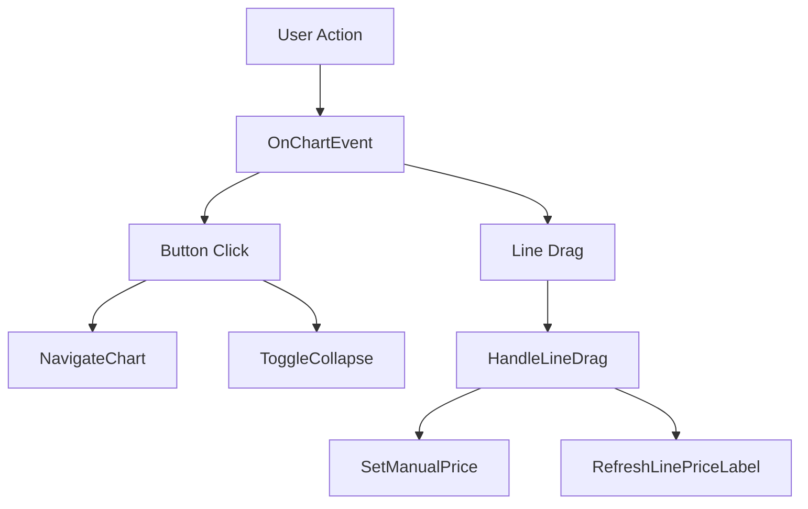
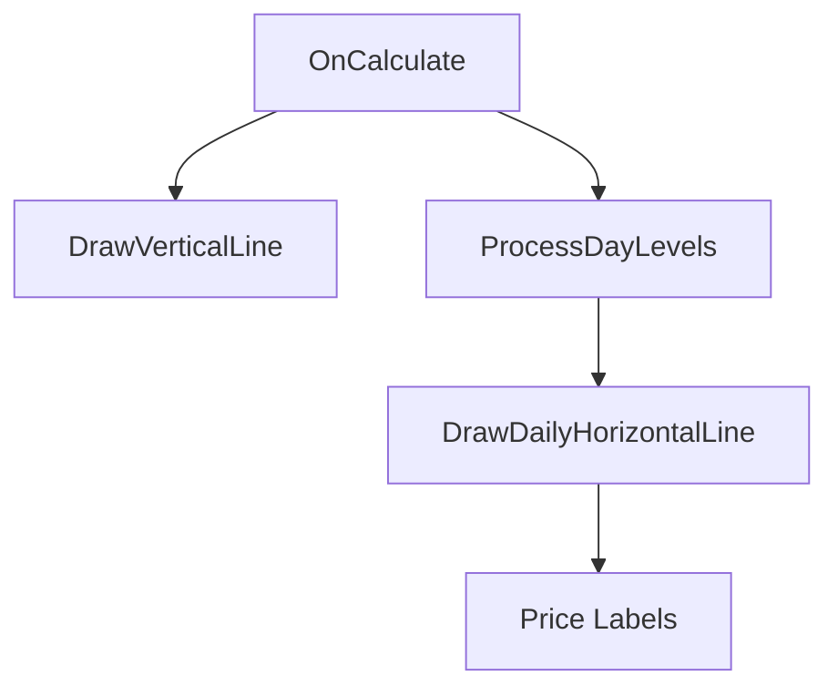

# DailyRefHighLow.mq5 – Code Flow & Architecture Overview

## Table of Contents
1. Overview
2. Architecture
3. Runtime Execution Flow
4. Core Components
5. Method Reference
6. Event Handling
7. Drawing System
8. Swing Detection Workflow
9. Dependencies

---

# 1. Overview

This MT5 indicator draws a daily reference vertical line and calculates High/Low (and optionally Intermediate) levels before a user-defined reference time.

Major responsibilities:

- Draw daily reference lines.
- Detect swing levels.
- Support multiple swing detection methods.
- Draw horizontal High / Low / Intermediate levels.
- Allow manual dragging of levels.
- Display optional price labels.
- Provide chart navigation controls.

---

# 2. Architecture

The indicator is organised into five logical layers:

```text
User Inputs
    │
    ▼
OnInit()
    │
    ▼
OnCalculate()
    │
    ├── DrawVerticalLine()
    ├── ProcessDayLevels()
    │      ├── FindReferenceIndex()
    │      └── DrawDailyHorizontalLine()
    │
    └── RefreshLinePriceLabel()

User Interaction
    │
    ▼
OnChartEvent()
    ├── HandleLineDrag()
    ├── NavigateChart()
    ├── ToggleCollapse()
    └── ResetNavigation()
```

---

# 3. Runtime Execution Flow

## Startup

1. MT5 loads indicator.
2. `OnInit()` executes.
3. Navigation panel and chart objects are created.

## Runtime

1. MT5 calls `OnCalculate()`.
2. Indicator iterates through visible trading days.
3. Reference time is calculated.
4. Vertical line is drawn.
5. Reference candle is located.
6. Swing levels are calculated.
7. Horizontal lines are drawn.
8. Labels are refreshed.

## User Interaction

When a chart object is moved or clicked:

1. `OnChartEvent()` receives event.
2. Action is identified.
3. Dragged line values are stored.
4. Labels are updated.

---

# 4. Core Components

## Reference Time Engine

Responsible for:

- Daily time calculations.
- Broker/server time conversion.
- DST handling.

Functions:

- `GetTargetBrokerTime`
- `IsTehran_DST`
- `IsUS_DST`
- `IsEU_DST`

---

## Swing Detection Engine

Responsible for:

- Locating reference candle.
- Determining High/Low values.
- Applying selected swing detection method.

Primary methods:

- `FindReferenceIndex`
- `ProcessDayLevels`

---

## Drawing Engine

Responsible for:

- Vertical lines
- Horizontal levels
- Labels

Primary methods:

- `DrawVerticalLine`
- `DrawDailyHorizontalLine`
- `RefreshLinePriceLabel`

---

## UI Engine

Responsible for:

- Navigation buttons
- Panel visibility
- Chart navigation

Primary methods:

- `BuildNavPanel`
- `ToggleCollapse`
- `NavigateChart`

---

# 5. Method Reference

## Storage Helpers

### GetManualPrice()

Purpose:
Returns a manually overridden price level for a dragged line.

### SetManualPrice()

Purpose:
Stores a user-defined level after dragging.

### ClearManualPrices()

Purpose:
Clears all saved manual overrides.

---

## Object Name Builders

### VLineName()

Creates unique vertical line names.

### HighName()

Creates unique High-line names.

### LowName()

Creates unique Low-line names.

### InterName()

Creates unique Intermediate-line names.

### HighLabelName()

Creates High label identifiers.

### LowLabelName()

Creates Low label identifiers.

### InterLabelName()

Creates Intermediate label identifiers.

---

## Lifecycle Methods

### OnInit()

Responsibilities:

- Initialisation.
- UI creation.
- Object preparation.

### OnDeinit()

Responsibilities:

- Cleanup.
- Object removal.

---

## Cleanup

### DeleteObjects()

Removes indicator-created chart objects.

### DeleteNavPanelObjects()

Removes navigation panel objects.

---

## Date Utilities

### DayStart()

Rounds a timestamp to the start of the trading day.

---

## UI Construction

### CreateRect()

Creates panel rectangles.

### CreateLabel()

Creates text labels.

### CreateButton()

Creates clickable buttons.

### BuildNavPanel()

Constructs the navigation interface.

### SetNavButtonsVisibility()

Shows or hides navigation controls.

### ToggleCollapse()

Collapses or expands panel.

---

## Dragging & Labels

### HandleLineDrag()

Triggered when a line is moved.

Responsibilities:

- Read new level.
- Store override.
- Refresh label.

### UpdatePriceLabelForLine()

Updates displayed price.

### DeletePriceLabelForLine()

Removes price label.

### RefreshLinePriceLabel()

Synchronises label with line value.

---

## Event Handling

### OnChartEvent()

Central event dispatcher.

Handles:

- Button clicks
- Object dragging
- Navigation actions

### ResetButton()

Returns button visual state.

---

## Navigation

### NavigateChart()

Moves chart backward or forward.

### ResetNavigation()

Returns chart to default view.

---

## Main Calculation

### OnCalculate()

Main execution routine.

Responsibilities:

- Process visible days.
- Calculate levels.
- Trigger drawing routines.
- Maintain chart objects.

This is the most important method in the indicator.

---

## Drawing

### DrawVerticalLine()

Draws daily reference line.

Inputs:

- Day start
- Target datetime

Output:

- Vertical chart object

### DrawDailyHorizontalLine()

Draws High/Low/Intermediate levels.

Supports:

- Level updates
- Styling
- Optional labels

---

## Swing Processing

### FindReferenceIndex()

Locates the candle corresponding to the reference time.

Inputs:

- Target time
- Price arrays

Output:

- Candle index

### ProcessDayLevels()

Core swing calculation routine.

Responsibilities:

- Determine reference window.
- Locate swing levels.
- Apply selected detection method.
- Generate final High/Low/Intermediate values.
- Trigger drawing.

---

## Time Conversion

### GetTargetBrokerTime()

Converts configured reference time into broker time.

---

## DST Helpers

### IsTehran_DST()

Tehran daylight-saving evaluation.

### IsUS_DST()

US daylight-saving evaluation.

### IsEU_DST()

EU daylight-saving evaluation.

---

# 6. Event Handling



---

# 7. Drawing System



---

# 8. Swing Detection Workflow

High-level logic:

1. Determine daily reference candle.
2. Scan historical candles before reference time.
3. Calculate base High/Low.
4. Apply selected swing method.
5. Generate optional Intermediate level.
6. Draw final levels.
7. Allow user overrides through dragging.

---

# 9. Dependencies

| Method | Depends On |
|----------|----------|
| OnCalculate | DrawVerticalLine, ProcessDayLevels |
| ProcessDayLevels | FindReferenceIndex, DrawDailyHorizontalLine |
| OnChartEvent | HandleLineDrag, NavigateChart |
| HandleLineDrag | SetManualPrice, RefreshLinePriceLabel |
| BuildNavPanel | CreateRect, CreateLabel, CreateButton |
| OnDeinit | DeleteObjects, DeleteNavPanelObjects |

---

# Summary

The indicator is primarily an event-driven MT5 drawing and swing-analysis tool. `OnCalculate()` acts as the calculation engine, `ProcessDayLevels()` performs swing analysis, `DrawDailyHorizontalLine()` and `DrawVerticalLine()` handle visualisation, and `OnChartEvent()` manages all user interaction including dragging, navigation, and label updates.
